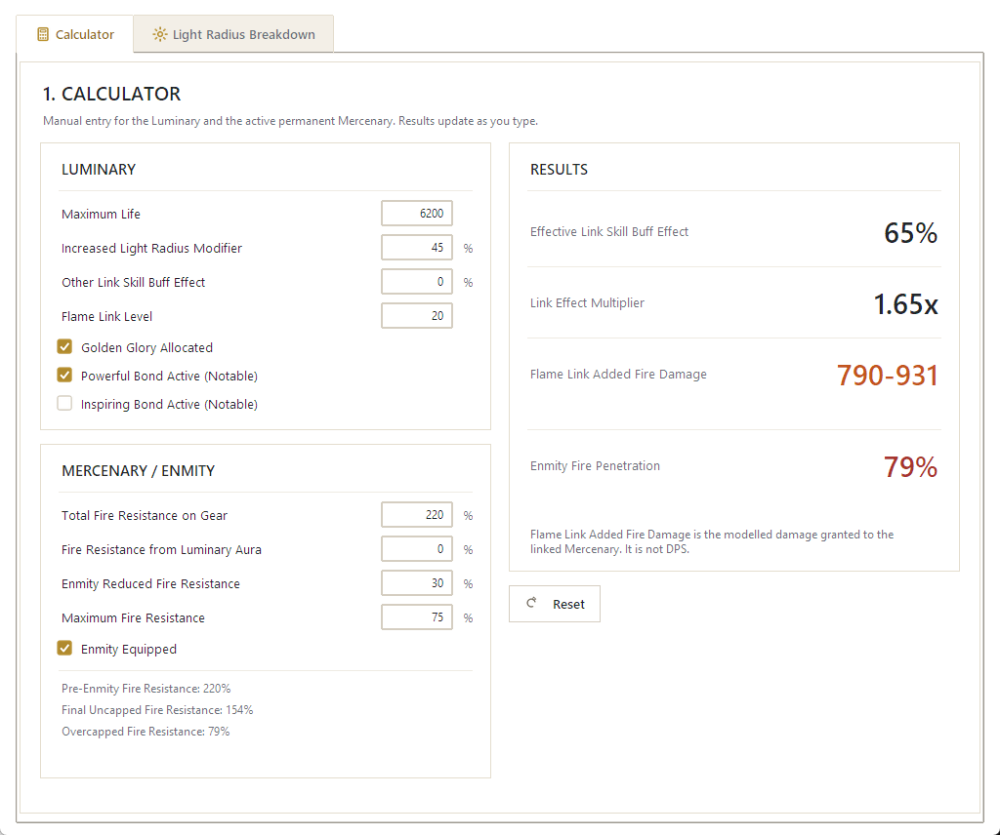
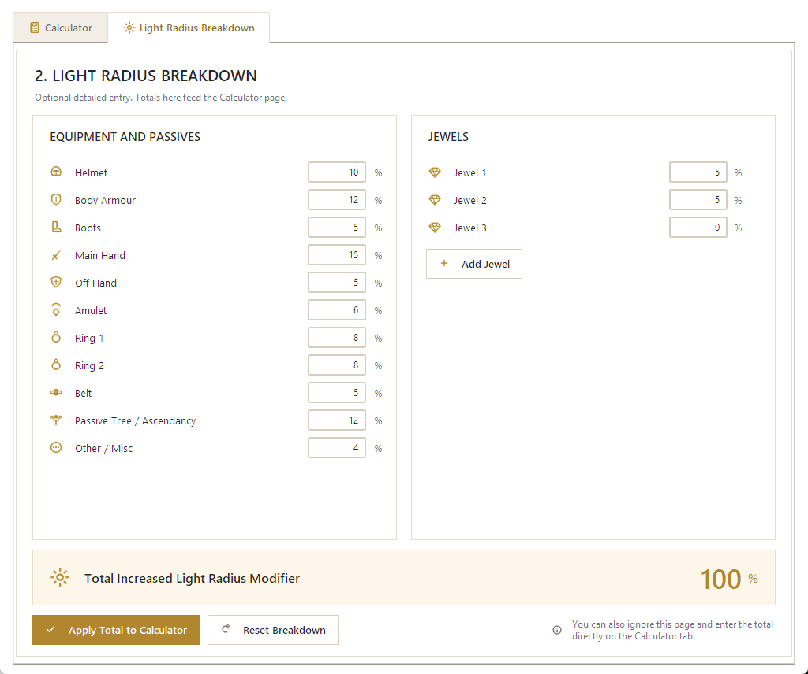

# Golden Glory Calculator

Golden Glory Calculator is a small Windows planning calculator for Path of
Exile 1 Luminary/Mercenary setups. It helps you manually estimate:

- **Effective Link Skill Buff Effect** from Golden Glory, Light Radius, other
  Link Buff Effect, Powerful Bond, and Inspiring Bond
- **Flame Link Added Fire Damage** granted to the linked Mercenary
- **Enmity's Embrace Fire Penetration** from the Mercenary's overcapped Fire
  Resistance
- Optional slot-by-slot **Light Radius** totals

It is manual-first: you type in the numbers you already know from your
character and Mercenary. A Path of Building import is **not** required.

This is a planning calculator, not a DPS calculator. It does not connect to
your Path of Exile account, does not read or modify Path of Building, and is
an independent community project with no affiliation to Grinding Gear Games.

## Download

**Recommended: `GoldenGloryCalculator-Setup.exe`**

1. Open the [latest GitHub Release](https://github.com/aidan600/Golden-Glory-Lab/releases/latest).
2. Download `GoldenGloryCalculator-Setup.exe`.
3. Run it.
4. Follow the short installer (a few clicks, no options to worry about).
5. Launch **Golden Glory Calculator** from the Start Menu, or from the
   desktop shortcut if you chose to create one.

A few things to expect:

- Windows may show a **SmartScreen** warning ("Windows protected your PC")
  because this early release is not code-signed. Choose **More info** ->
  **Run anyway** if you trust the download.
- No Python installation is required. The installer and the application are
  fully self-contained.
- The application runs entirely on your machine. It does not require or use
  an internet connection.

**Portable alternative: `GoldenGloryCalculator.exe`**

If you would rather not install anything, download `GoldenGloryCalculator.exe`
from the same release and run it directly — no installation, no setup wizard.
You can put it anywhere, including a USB drive, and delete it whenever you
like.

Cloning this repository or running Python is only needed if you want to build
the application yourself; see [docs/INSTALL.md](docs/INSTALL.md) for that.

## Using the Calculator

The application has two tabs: **Calculator** and **Light Radius Breakdown**.

### Calculator tab

1. Enter the Luminary's **Maximum Life**.
2. Enter the total **Increased Light Radius Modifier** directly, or leave it
   for now and build it slot-by-slot on the **Light Radius Breakdown** tab.
3. Enter any **Other Link Skill Buff Effect** from sources besides Golden
   Glory.
4. Enter the final **Flame Link Level**.
5. Toggle **Golden Glory Allocated**, **Powerful Bond Active**, and
   **Inspiring Bond Active** as appropriate for your build.
6. For the Mercenary's Enmity's Embrace, enter:
   - **Total Fire Resistance on Gear**
   - **Fire Resistance from Luminary Aura** (optional — leave blank or 0 if
     none)
   - **Enmity Reduced Fire Resistance** (the roll on Enmity's Embrace)
   - **Maximum Fire Resistance**
   - toggle **Enmity Equipped**
7. Read the results on the right. They update live as you type.

The four results shown are:

- **Effective Link Skill Buff Effect** — the combined Link Buff Effect after
  Golden Glory, Light Radius, other Link Buff Effect sources, Powerful Bond,
  and Inspiring Bond.
- **Link Effect Multiplier** — the same result expressed as a multiplier.
- **Flame Link Added Fire Damage** — the modelled flat Fire Damage granted to
  the linked Mercenary. This is granted damage, not DPS.
- **Enmity Fire Penetration** — Fire Penetration derived from the Mercenary's
  overcapped Fire Resistance, capped at 200%.

### Light Radius Breakdown tab

This tab is entirely optional. If you would rather not add up your Light
Radius sources by hand, enter them slot-by-slot here — Helmet, Body Armour,
Boots, Main Hand, Off Hand, Amulet, both Rings, Belt, Passive Tree /
Ascendancy, Other / Misc, and any number of Jewels — then press
**Apply Total to Calculator** to copy the total onto the Calculator tab.

The list of slots is a manual planning aid, not a comprehensive current item
catalog. It does not restrict what you can type into any field.

## Calculation notes / limitations

- Golden Glory applies your Light Radius increases and reductions toward Link
  Skill Buff Effect on the Mercenary.
- Powerful Bond and Inspiring Bond each add +20% Link Buff Effect while their
  respective condition is active.
- Flame Link adds its level-based flat Fire Damage plus 5% of the Luminary's
  Maximum Life, then applies the Link Buff Effect on top.
- The Flame Link integer result is **modelled**. It has not been independently
  confirmed against live-client rounding, so treat it as an estimate rather
  than an exact in-game value.
- Enmity Fire Penetration is based on overcapped Fire Resistance and capped at
  200%.
- The simplified Enmity planner applies your entered Enmity Reduced Fire
  Resistance to the pre-Enmity resistance pool, then truncates the fractional
  result toward zero before the overcap is calculated — matching current
  Path of Building's modelled behavior.
- This calculator does not compute total character DPS.

**Target game context:** Path of Exile 1, current project mechanics target
patch **3.29.x**. This is not a guarantee of accuracy against every future
patch — mechanics can change, and this project may lag behind a live patch
until it is re-verified.

## Helpful external references

These links are informational only. They are not required for the
application to run, and the application does not read from them at runtime.

- [Path of Building Community](https://github.com/PathOfBuildingCommunity/PathOfBuilding)
- [Golden Glory / Link notables — PoEDB](https://poedb.tw/us/Link)
- [Flame Link — PoEDB](https://poedb.tw/us/Flame_Link)
- [Light Radius — PoEDB](https://poedb.tw/us/Light_radius)
- [Enmity's Embrace — PoEDB](https://poedb.tw/us/Enmitys_Embrace)

PoEDB is an independent community reference, not an official Grinding Gear
Games source.

## For developers

This repository also contains an older, experimental diagnostic desktop
workflow (PoB import, item mapping/review, evidence tooling, save/open) that
is not part of the ordinary Golden Glory Calculator product. See
[docs/CURRENT_STATE.md](docs/CURRENT_STATE.md) for what is currently active
versus deferred, and [docs/INSTALL.md](docs/INSTALL.md) for how to build the
calculator, the portable EXE, and the Windows installer from source.

Start with [the documentation index](docs/INDEX.md) and
[the repository agent guide](AGENTS.md). Product scope lives in
[docs/PRODUCT_DIRECTION.md](docs/PRODUCT_DIRECTION.md); unresolved work is
tracked in [docs/OPEN_QUESTIONS.md](docs/OPEN_QUESTIONS.md).

Run the repository checks with:

    node scripts/validate/check_repository.mjs

The check parses every JSON file, validates the source registry against its
repository schema, checks repository-relative Markdown links, and confirms the
files referenced from AGENTS.md exist.
